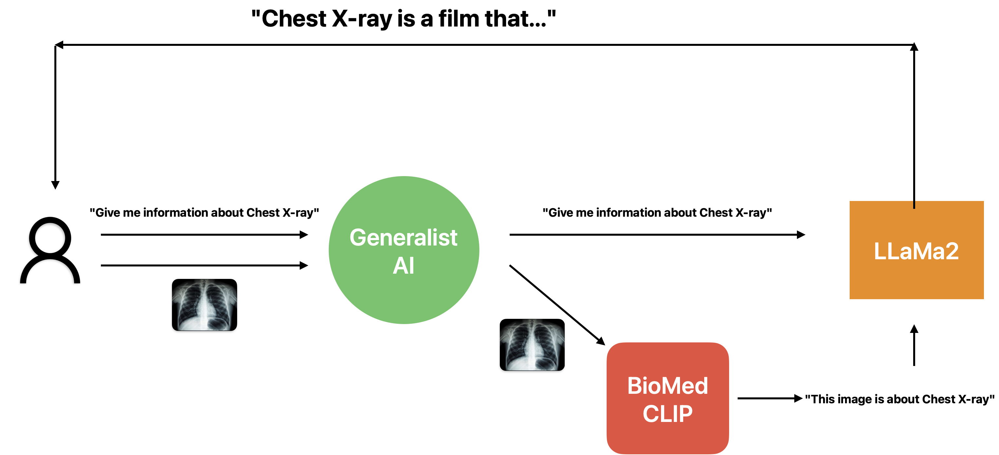

# Low-Cost Generalist AI for Medical assistance

A low-budget Generalist AI that allows users to ask about Medical domain, moreover, users can provide images instead of text. By carefully selecting models, our AI agent can work effectively with just 8GB of RAM on GCP's Compute Engine.

[LLaMa-2-7B-GGUF](https://huggingface.co/TheBloke/Llama-2-7B-GGUF) is the heart of the assistance. This Language Model can offer beneficial responses when users inquire about illnesses, symptoms, etc. [llama-cpp-python](https://github.com/abetlen/llama-cpp-python) is a friendly interface to deploy `4-bit` quantization model that uses only `~3.8GB` of RAM.

Despite LLM's strength, they appear to be "blind" to the visual data. A retrieval-base model called [BiomedCLIP-PubMedBert](https://huggingface.co/microsoft/BiomedCLIP-PubMedBERT_256-vit_base_patch16_224) helps the LLM process visual data. This uses roughly {~1GB} of RAM.

An interactive chatbot user interface (UI) is created using [Gradio](https://www.gradio.app), which enables simple interactions with users. To connect the UI with these aforcehead models, [Fast API](https://fastapi.tiangolo.com/tutorial/path-params/?h=path#path-parameters-containing-paths) is used, which uses [Streaming Response](https://fastapi.tiangolo.com/advanced/custom-response/#streamingresponse) to generate tokens sequentially like ChatGPT.

<div style="text-align:center">
  
</div>

## Setup

<div style="text-align:center">
  
</div>

1. Install dependencies
```
pip install -r requirements.txt
```

2. Download [LLaMa2 GGUF](TheBloke/Llama-2-7B-GGUF) as Language Model
Create `ckpt` folder to store checkpoints
```
mkdir ckpt
```
Download the model by using `huggingface-cli` from Huggingface hub, find more at [here](https://huggingface.co/TheBloke/Llama-2-7B-GGUF)
```
huggingface-cli download TheBloke/Llama-2-7B-GGUF llama-2-7b.Q4_K_S.gguf --local-dir ./ckpt --local-dir-use-symlinks False
```

## Deploy the service

1. Run Language Model can receive and reponse text
```
python3 llm.py
```

2. Run CLIP receives image as input which supports 'blind' LLM 
```
python3 api.py
```

3. Run Gradio web UI
```
gradio agent.py
```